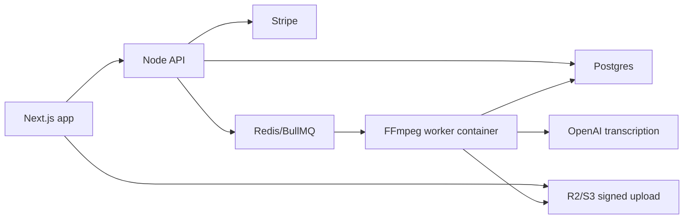

# Shortform Content Ops SaaS Architecture

This is the production architecture target for turning the local
`content-ops-agent` workflow into a subscription SaaS.

## Stack Decision

- Frontend: Next.js App Router with React and TypeScript
- Backend: Node API service, preferably Fastify or NestJS
- Database: Postgres
- Object storage: Cloudflare R2 by default, S3-compatible by contract
- Queue: Redis and BullMQ by default, SQS-compatible at the boundary
- Workers: containerized FFmpeg plus overlay rendering
- Transcription: OpenAI audio transcription API
- Billing: Stripe subscriptions and webhooks

## System Flow



## Content Style Intelligence Layer

The original workflow remains the product backbone:

```text
upload/import video -> transcribe -> analyze -> suggest clips -> render outputs
```

The content style intelligence layer sits between transcription and rendering.
It should make the product valuable across creator niches without turning the
runtime into a generic freeform editor. The layer analyzes the transcript,
source metadata, scene/audio signals, and optional user settings, then produces
profile-aware clip candidates and dashboard suggestions.

Initial content profiles:

- `vlog`
- `gaming`
- `stream_clip`
- `tutorial`
- `product_demo`
- `podcast`
- `talking_head`
- `fitness`
- `health`
- `news_commentary`

Each profile defines:

- target clip length ranges
- hook patterns and title angles
- pacing and cut aggressiveness
- caption density and caption style
- overlay and callout behavior
- platform fit for YouTube Shorts, TikTok, Reels, and X
- retention risks and recommended fixes
- safety or compliance checks where relevant

The first implementation should focus on five high-value profile families:

- vlogs
- gaming and stream clips
- tutorials and product demos
- podcasts and talking-head commentary
- fitness, health, and wellness

Health-related profiles must avoid unsupported medical claims. Suggestions in
those profiles should prefer educational language and flag risky wording for
review instead of generating definitive advice.

## Dashboard Intelligence Surface

The frontend should be a creator operations dashboard, not only a render form.
For each project, the dashboard should expose:

- project status, source metadata, transcription status, render status, and
  usage minutes
- detected content profile, confidence, and any user-selected override
- topic and segment analysis
- ranked clip candidates with timestamps, scores, reasons, hooks, titles,
  captions, target platforms, and expected use cases
- actionable edit suggestions such as shorten the intro, add a comparison
  overlay, convert a section into a 30-second Reel, or split a tutorial into a
  sequence
- brand/profile settings including tone, caption style, logo, colors,
  preferred calls to action, and blocked phrases
- approved render queue, progress, previews, and signed output downloads
- optional content calendar suggestions for repurposing approved clips

The key user promise is: upload longform content, review the best opportunities
with reasons, approve clips, and receive platform-ready outputs.

## First Implemented Contract

The initial Python contract lives in `src/llm/content_ops/platform.py`. The
backend API contract is being ported into `apps/api`, and the worker queue
payload is pinned by `schemas/content-ops-render-job-v1.schema.json`.
API startup now uses a real Postgres client when `DATABASE_URL` is configured
and runs SQL migrations through a checksum-tracked `schema_migrations` table.
Render jobs are dispatched to BullMQ via Redis when `REDIS_URL` is configured.
Source uploads are presigned through an R2/S3-compatible storage signer so the
browser can upload directly without receiving storage credentials.
API startup validates the Stripe and OpenAI environment settings needed by the
billing and transcription integrations before accepting traffic.
Completed render jobs can now return short-lived signed output download URLs
from the render job read endpoint when a worker has persisted an output
manifest.

It defines:

- subscription tiers and render entitlements
- monthly render-minute and active-job gates
- deterministic R2/S3 object keys
- queue payloads for worker containers
- idempotency keys for safe retries
- allowed render job state transitions

This keeps expensive work out of the request path. The API should create a
database render job, check entitlements, enqueue the payload, and let workers
advance the job through the lifecycle.

## Render Job Lifecycle

```text
created
uploaded
transcribing
transcribed
render_queued
rendering
ready
failed
canceled
```

Invalid jumps are blocked by `transition_job_status`. Terminal states do not
transition further.

## Storage Layout

Object keys are scoped by workspace and project:

```text
workspaces/{workspace_id}/projects/{project_id}/uploads/{asset_id}/{filename}
workspaces/{workspace_id}/projects/{project_id}/audio/{asset_id}/source.wav
workspaces/{workspace_id}/projects/{project_id}/transcripts/{asset_id}/transcript.json
workspaces/{workspace_id}/projects/{project_id}/renders/{asset_id}/
```

The frontend should upload directly to R2/S3 with a signed URL. The API and
worker pass storage keys, not secrets.

## API Surface To Build Next

Minimum backend endpoints:

- `POST /api/projects` creates a project container.
- `POST /api/uploads/presign` returns a signed upload target. Initial API
  handler implemented for PUT uploads with media asset persistence and plan
  upload-size checks.
- `POST /api/render-jobs` validates subscription usage and enqueues work.
  Initial API handler and Redis/BullMQ producer implemented.
- `GET /api/render-jobs/:id` returns job status and output URLs. Initial API
  handler implemented with signed output URLs for completed jobs that have an
  output manifest.
- `POST /api/stripe/webhook` syncs subscription state from Stripe.
- `POST /api/billing/checkout` creates Stripe Checkout sessions.
- `POST /api/billing/portal` opens Stripe customer portal sessions.

Every API response should use the same envelope:

```json
{
  "success": true,
  "data": {},
  "error": null
}
```

## Database Tables

Minimum Postgres tables:

- `workspaces`
- `users`
- `workspace_members`
- `subscriptions`
- `projects`
- `media_assets`
- `render_jobs`
- `usage_ledger`
- `webhook_events`
- `content_profiles`
- `analysis_runs`
- `clip_candidates`
- `dashboard_suggestions`
- `brand_kits`

`webhook_events` and `render_jobs` need idempotency keys. Stripe webhook events
must be processed exactly once from the application's point of view.

## Worker Contract

The worker consumes `content_ops.render_job.v1` payloads from
`content-ops-render`. The JSON schema for that payload lives at
`schemas/content-ops-render-job-v1.schema.json`.

Worker responsibilities:

- download the uploaded source asset
- extract audio with FFmpeg
- transcribe through OpenAI
- detect or apply the selected content profile
- run profile-aware clip analysis
- persist ranked clip candidates and dashboard suggestions
- generate overlays
- render clips with FFmpeg
- upload final outputs
- update Postgres progress after each durable step

The worker must not trust client-provided subscription or pricing data. Those
checks belong to the API before enqueueing.

## Security And Billing Rules

- Never put OpenAI, Stripe, R2, S3, or database secrets in queue payloads.
- Validate all IDs and uploaded file metadata at the API boundary.
- Use signed upload and download URLs with short expiry windows.
- Only sign render outputs whose storage keys remain under the job's render
  output prefix.
- Treat Stripe webhooks as the billing source of truth.
- Gate render jobs by subscription tier before enqueueing.
- Track render minutes in an append-only usage ledger.
- Make worker updates idempotent so retries do not double-count usage.
