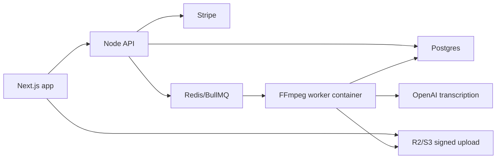

# Shortform Content Ops SaaS Architecture

This is the production architecture target for turning the local
`content-ops-agent` workflow into a subscription SaaS.

## Stack Decision

- Frontend: Next.js App Router with React and TypeScript
- Backend: Node API service, preferably Fastify or NestJS
- Database: Postgres
- Object storage: Cloudflare R2 by default, S3-compatible by contract
- Queue: Redis and BullMQ by default, SQS-compatible at the boundary
- Workers: containerized FFmpeg plus overlay rendering
- Transcription: OpenAI audio transcription API
- Billing: Stripe subscriptions and webhooks

## System Flow



## First Implemented Contract

The initial code contract lives in `src/llm/content_ops/platform.py`.

It defines:

- subscription tiers and render entitlements
- monthly render-minute and active-job gates
- deterministic R2/S3 object keys
- queue payloads for worker containers
- idempotency keys for safe retries
- allowed render job state transitions

This keeps expensive work out of the request path. The API should create a
database render job, check entitlements, enqueue the payload, and let workers
advance the job through the lifecycle.

## Render Job Lifecycle

```text
created
uploaded
transcribing
transcribed
render_queued
rendering
ready
failed
canceled
```

Invalid jumps are blocked by `transition_job_status`. Terminal states do not
transition further.

## Storage Layout

Object keys are scoped by workspace and project:

```text
workspaces/{workspace_id}/projects/{project_id}/uploads/{asset_id}/{filename}
workspaces/{workspace_id}/projects/{project_id}/audio/{asset_id}/source.wav
workspaces/{workspace_id}/projects/{project_id}/transcripts/{asset_id}/transcript.json
workspaces/{workspace_id}/projects/{project_id}/renders/{asset_id}/
```

The frontend should upload directly to R2/S3 with a signed URL. The API and
worker pass storage keys, not secrets.

## API Surface To Build Next

Minimum backend endpoints:

- `POST /api/projects` creates a project container.
- `POST /api/uploads/presign` returns a signed upload target.
- `POST /api/render-jobs` validates subscription usage and enqueues work.
- `GET /api/render-jobs/:id` returns job status and output URLs.
- `POST /api/stripe/webhook` syncs subscription state from Stripe.
- `POST /api/billing/checkout` creates Stripe Checkout sessions.
- `POST /api/billing/portal` opens Stripe customer portal sessions.

Every API response should use the same envelope:

```json
{
  "success": true,
  "data": {},
  "error": null
}
```

## Database Tables

Minimum Postgres tables:

- `workspaces`
- `users`
- `workspace_members`
- `subscriptions`
- `projects`
- `media_assets`
- `render_jobs`
- `usage_ledger`
- `webhook_events`

`webhook_events` and `render_jobs` need idempotency keys. Stripe webhook events
must be processed exactly once from the application's point of view.

## Worker Contract

The worker consumes `content_ops.render_job.v1` payloads from
`content-ops-render`.

Worker responsibilities:

- download the uploaded source asset
- extract audio with FFmpeg
- transcribe through OpenAI
- run the clip planning agent
- generate overlays
- render clips with FFmpeg
- upload final outputs
- update Postgres progress after each durable step

The worker must not trust client-provided subscription or pricing data. Those
checks belong to the API before enqueueing.

## Security And Billing Rules

- Never put OpenAI, Stripe, R2, S3, or database secrets in queue payloads.
- Validate all IDs and uploaded file metadata at the API boundary.
- Use signed upload and download URLs with short expiry windows.
- Treat Stripe webhooks as the billing source of truth.
- Gate render jobs by subscription tier before enqueueing.
- Track render minutes in an append-only usage ledger.
- Make worker updates idempotent so retries do not double-count usage.
